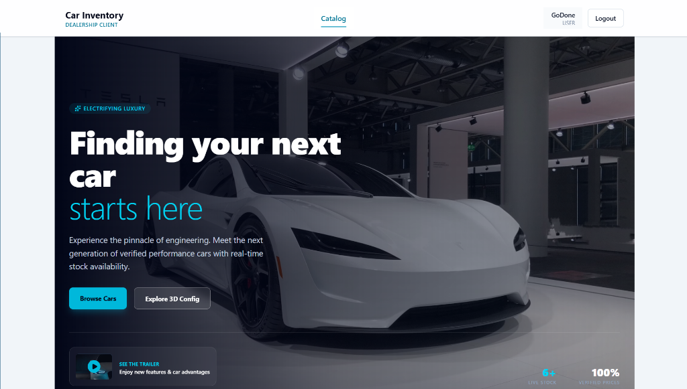
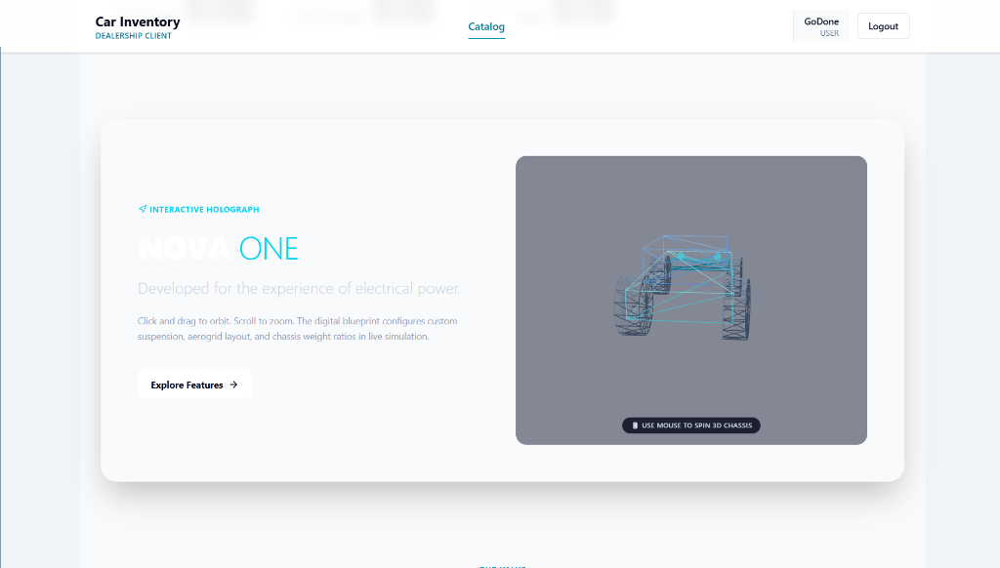

# Car Dealership Inventory System

[](https://github.com/HRVargiya-2000s/Hiren_Vargiya_IncuByte_Assessment)

A full-stack React and Node.js/Express application for browsing dealership inventory, purchasing luxury performance vehicles, interactive 3D holograph previewing, and managing inventory stock. The core assessment features are extended with interactive 3D configurators, custom Tailwind luxury design systems, toast notification alerts, and comprehensive automated test coverage.



## Quick Start

```bash
git clone https://github.com/HRVargiya-2000s/Hiren_Vargiya_IncuByte_Assessment.git
cd Hiren_Vargiya_IncuByte_Assessment

# 1. Setup & Start Backend Server
cd backend
npm install
npm run seed-vehicles
npm run dev

# 2. Setup & Start Frontend Application (in a separate terminal)
cd ../frontend
npm install
npm run dev
```

Open `http://localhost:5173` in your browser. Backend runs on `http://localhost:5000`.

---

## Prerequisites

- **Node.js**: `v18+` or `v20+`
- **npm**: `v9+` or `v10+`
- **PostgreSQL**: `v14+` (or local PostgreSQL container/service)
- **Git**: `v2+`

---

## Environment Configuration

Copy the example configuration to `.env` files in root and backend:

### Root / Backend `.env`

| Variable | Purpose | Default |
| --- | --- | --- |
| `PORT` | Backend server port | `5000` |
| `DB_HOST` | PostgreSQL host | `localhost` |
| `DB_PORT` | PostgreSQL port | `5432` |
| `DB_USER` | PostgreSQL user | `postgres` |
| `DB_PASSWORD` | PostgreSQL password | `password123` |
| `DB_NAME` | Database name | `car_dealership_db` |
| `JWT_SECRET` | Secret signing key for JWT tokens | `5j@9!LkP#2mVxQ7nR8sTz4AaBcDeFgHi` |
| `VITE_API_BASE_URL` | Frontend API endpoint target | `http://localhost:5000/api` |

---

## PostgreSQL Database Setup

Create the PostgreSQL database manually or via psql shell:

```sql
CREATE DATABASE car_dealership_db;
```

To seed initial luxury vehicles into PostgreSQL database:

```bash
cd backend
npm run seed-vehicles
```

---

## Installation & Running the Application

### Backend Setup

```bash
cd backend
npm install
npm run dev
```

- Backend API running at: `http://localhost:5000`

### Frontend Setup

```bash
cd frontend
npm install
npm run dev
```

- Frontend App running at: `http://localhost:5173`

---

## User & Administrator Credentials

For testing and demonstration, use the seeded accounts or create a new user via public registration:

| Role | Email | Password | Access |
| --- | --- | --- | --- |
| **USER** | `godone@gmail.com` | `godone123` | Browse catalog, view details, purchase vehicles |
| **ADMIN** | `admin@example.com` | `Admin@123` | Full inventory CRUD, restock stock, view dashboard analytics |

---

## Running Tests

Automated test suites cover both frontend UI components/user journeys and backend API endpoints:

### Frontend Test Suite (Vitest + React Testing Library)

```bash
cd frontend
npx vitest run
```

### Backend Test Suite (Vitest + Supertest)

```bash
cd backend
npx vitest run
```

---

## Project Scope

### Core Assignment Features

1. **Authentication & Authorization**
   - Registration and login authentication
   - Password security with `bcrypt` hashing & JWT bearer authorization
   - `USER` and `ADMIN` role management

2. **Vehicle CRUD Management**
   - Administrator vehicle creation, editing, restock, and deletion
   - Data validation and stock quantity constraints
   - Role-protected action buttons and backend API route guards

3. **Search, Filtering & Pagination**
   - Real-time vehicle title search
   - Make (Honda, Hyundai, MG, Toyota, etc.), category (Sedan, SUV, Hatchback, MPV), and price range filters
   - Price low-to-high, high-to-low, newest first, and stock level sorting
   - Server-backed pagination controls

4. **Purchase & Restock Workflow**
   - Single-click atomic purchases reducing stock in real-time
   - Modal confirmation workflows and out-of-stock state handling
   - Administrator restocking controls to increase inventory levels

### Additional Premium Features

- **3D Interactive Hologram Chassis Configurator (`ThreeCarShowcase`)**: Interactive Three.js & React Three Fiber 3D wireframe vehicle canvas allowing users to orbit, spin, and zoom chassis geometry.
- **Tesla & Porsche Inspired Luxury Aesthetic**: Vibrant dark-mode hero banner, smooth cyan glow highlights, subtle glassmorphism cards, and Framer Motion layout animations.
- **Indian Rupee (`₹`) Price Formatting**: Localized pricing formatters across catalog, vehicle details, and admin dashboards.
- **Toast Alerts & Feedback**: Reusable animated feedback toasts for actions (purchase confirmation, restock, edit, delete).

---

## Role Permissions

| Capability | USER | ADMIN |
| --- | :---: | :---: |
| Browse, search, filter, sort & paginate catalog | ✓ | ✓ |
| View detailed specifications & 3D holograph | ✓ | ✓ |
| Purchase available inventory vehicles | ✓ | ✓ |
| Access Admin Dashboard & overview metrics | — | ✓ |
| Create, update, delete vehicles | — | ✓ |
| Restock inventory quantities | — | ✓ |

---

## Technology Stack

- **Frontend:** React 19, Vite 8, Tailwind CSS 4, Three.js, `@react-three/fiber`, `@react-three/drei`, Framer Motion, Lucide React, Axios, React Router 7
- **Backend:** Node.js, Express 5, PostgreSQL (`pg`), `bcrypt`, `jsonwebtoken`, `dotenv`
- **Testing:** Vitest, React Testing Library, Supertest, JSDOM

---

## System Architecture

```text
React UI (Frontend - Vite)
   │
   │  HTTP / JSON + JWT Authorization Header
   ▼
Express Routes & Auth Middleware (Backend)
   │
   │  Controllers & Business Logic
   ▼
PostgreSQL Models & Database Queries (pg)
   │
   ▼
PostgreSQL Database (car_dealership_db)
```

---

## Repository Structure

```text
.
├── backend/
│   ├── src/
│   │   ├── config/          # Database connection configuration
│   │   ├── database/        # Database migrations & seed scripts (create-admin, seed-vehicles)
│   │   ├── middleware/      # Auth & role verification middleware
│   │   ├── models/          # Vehicle and User SQL models
│   │   ├── routes/          # Express route handlers (auth, vehicles, dashboard)
│   │   ├── services/        # Transaction & vehicle business logic
│   │   ├── tests/           # Integration & API test suites
│   │   ├── utils/           # Helper utilities (jwt, password hashing)
│   │   ├── app.js           # Express app setup and middleware configuration
│   │   └── server.js        # Backend entry point
│   ├── package.json
│   └── vitest.config.js
├── frontend/
│   ├── src/
│   │   ├── api/             # Axios API client setup
│   │   ├── assets/          # Static media and brand logos
│   │   ├── components/      # UI components (common, vehicle, 3D showcase)
│   │   │   ├── common/      # Button, Footer, Header, Loader, Modal, SearchBar, Toast
│   │   │   └── vehicle/     # VehicleCard, VehicleGrid, ThreeCarShowcase
│   │   ├── context/         # AuthContext state management
│   │   ├── hooks/           # Custom React hooks
│   │   ├── layouts/         # Layout wrappers for User & Admin
│   │   ├── pages/           # Pages (Home, VehicleDetails, Login, Register, Admin Dashboard)
│   │   ├── routes/          # AppRoutes definition & role protection
│   │   ├── services/        # Vehicle & Auth API services
│   │   ├── tests/           # Component & page unit tests
│   │   ├── utils/           # Currency formatters & image helpers
│   │   ├── App.jsx          # Root application component
│   │   ├── index.css        # Tailwind CSS styles and theme tokens
│   │   └── main.jsx         # React DOM entry point
│   ├── package.json
│   └── vite.config.js
├── docs/
│   └── screenshots/         # Application interface screenshots
│       ├── hero-section.png
│       └── 3d-holograph.png
├── .env                     # Environment configuration
├── PROMPTS.md               # Prompt history & TDD workflow record
└── README.md                # Project documentation
```

---

## Feature-wise Test Coverage

| Feature | Unit | API | Database | Frontend |
| --- | :---: | :---: | :---: | :---: |
| Authentication & JWT | ✓ | ✓ | ✓ | ✓ |
| Vehicle CRUD Operations | ✓ | ✓ | ✓ | ✓ |
| Search, Filter & Sort | ✓ | ✓ | ✓ | ✓ |
| Purchase & Restock | ✓ | ✓ | ✓ | ✓ |
| 3D Configurator Canvas | ✓ | — | — | ✓ |
| Responsive UI Layouts | ✓ | — | — | ✓ |

---

## Screenshots

| Customer Landing & Luxury Hero | Interactive 3D Holograph Chassis Configurator |
| --- | --- |
|  |  |

---

## My AI Usage

- Used AI for code refactoring, TDD test script structure, and documentation generation.
- Platforms used: Gemini, Claude 3.5 Sonnet, Codex, ChatGPT.
- All AI-assisted suggestions were audited, verified, and validated against automated test suites (`vitest`) and local builds.

---

## License

This project is licensed under the **MIT License**.

```text
MIT License

Copyright (c) 2026 Hiren Vargiya

Permission is hereby granted, free of charge, to any person obtaining a copy
of this software and associated documentation files (the "Software"), to deal
in the Software without restriction, including without limitation the rights
to use, copy, modify, merge, publish, distribute, sublicense, and/or sell
copies of the Software, and to permit persons to whom the Software is
furnished to do so, subject to the following conditions:

The above copyright notice and this permission notice shall be included in all
copies or substantial portions of the Software.

THE SOFTWARE IS PROVIDED "AS IS", WITHOUT WARRANTY OF ANY KIND, EXPRESS OR
IMPLIED, INCLUDING BUT NOT LIMITED TO THE WARRANTIES OF MERCHANTABILITY,
FITNESS FOR A PARTICULAR PURPOSE AND NONINFRINGEMENT. IN NO EVENT SHALL THE
AUTHORS OR COPYRIGHT HOLDERS BE LIABLE FOR ANY CLAIM, DAMAGES OR OTHER
LIABILITY, WHETHER IN AN ACTION OF CONTRACT, TORT OR OTHERWISE, ARISING FROM,
OUT OF OR IN CONNECTION WITH THE SOFTWARE OR THE USE OR OTHER DEALINGS IN THE
SOFTWARE.
```
